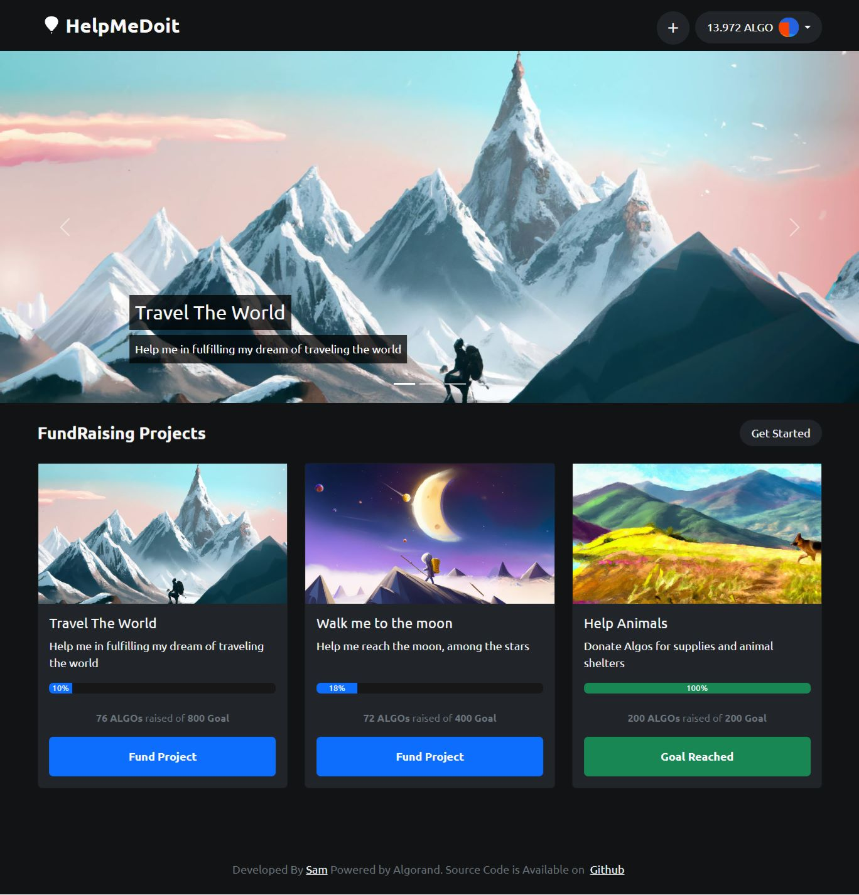
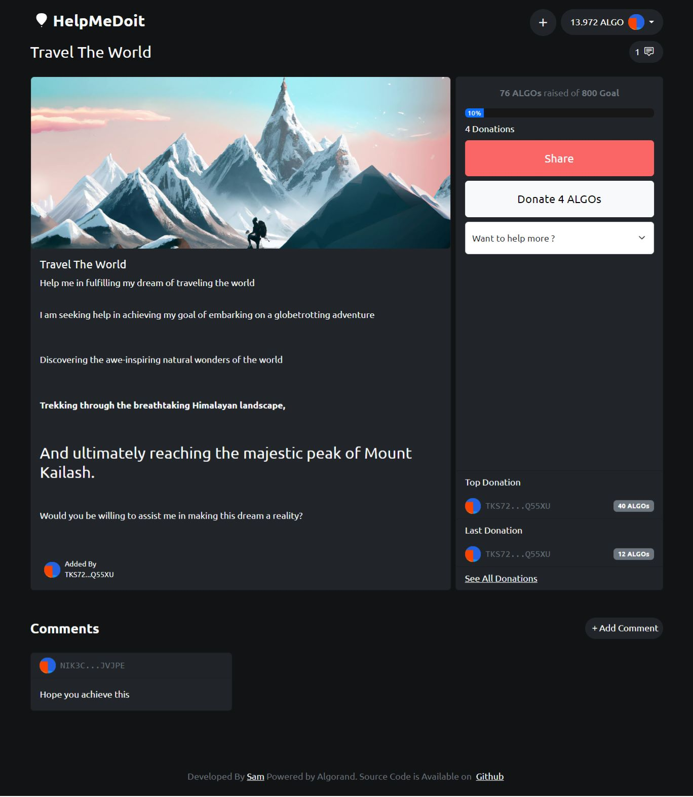

<div align="center">

<h2 align="center">HelpMeDoIt, Decentralized FundRaising Platform</h2>

<p align="justify">A Decentralized Platform to Raise Funds ( in ALGOs ) For Your Most Important Project and Donate Some ALGO(s) To Help Your Fellows In Need</p>
</div>
<br/>
<div>
<h3 align="left"><a href="https://sam-shariat.github.io/HMDI/" target="_blank">Live Demo</a></h3>
<p> homepage screenshot </p>

<p> project/cause page screenshot </p>

<br/>
</div>

## :briefcase: Used Libraries

- This project was bootstrapped with [Create React App](https://github.com/facebook/create-react-app)
- Algorand Official SDK : [algosdk](https://www.npmjs.com/package/algosdk)
- My Algo Wallet SDK : [myalgo-connect](https://www.npmjs.com/package/@randlabs/myalgo-connect)

## :point_down: Features

### working

- Create Project and Raise Funds ( on Algorand Blockchain)
- Comments on Projects
- Upload directly to ipfs using pinata API

### in progress

- on-chain Profile
- likes and comments
- donations and doners listings
- many more improvements

<!-- GETTING STARTED -->

## :point_down: Getting Started

### Prerequisites

- [Node.js](https://nodejs.org/en/) v16.xx.x

### Run locally

1. Clone repo

   ```sh
   git clone https://github.com/sam-shariat/HMDI.git
   ```

2. Install packages
   ```sh
   npm install
   ```
3. Run application
   ```sh
   npm start
   ```
4. Open development server on http://localhost:3000

<p align="right">(<a href="#top">back to top</a>)</p>

## :computer: Development: Connect to testnet wallet

- Create account on testnet using [MyAlgo Wallet](https://wallet.myalgo.com/)
- Add funds using [faucet](https://bank.testnet.algorand.network/)
- Start app, click "Connect Wallet" and use MyAlgo Wallet UI to connect testnet wallet

<p align="right">(<a href="#top">back to top</a>)</p>

<!-- CONTRIBUTING -->

## :writing_hand: Contributing

Contributions are what make the open source community such an amazing place to learn, inspire, and create. Any contributions you make are **greatly appreciated**.

If you have a suggestion that would make this better, please fork the repo and create a pull request. You can also
simply open an issue with the tag "enhancement". Don't forget to give the project a star! Thanks again!

1. Fork the Project
2. Create your Feature Branch (`git checkout -b feature/AmazingFeature`)
3. Commit your Changes (`git commit -m 'Add some AmazingFeature'`)
4. Push to the Branch (`git push origin feature/AmazingFeature`)
5. Open a Pull Request

<p align="right">(<a href="#top">back to top</a>)</p>
